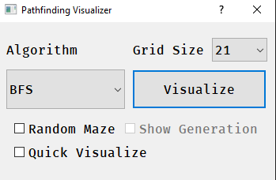
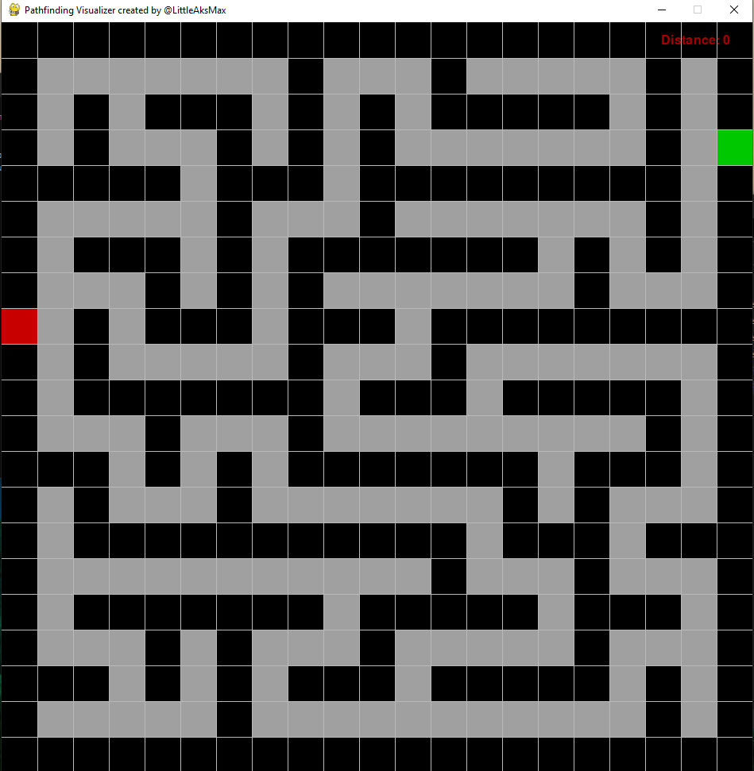
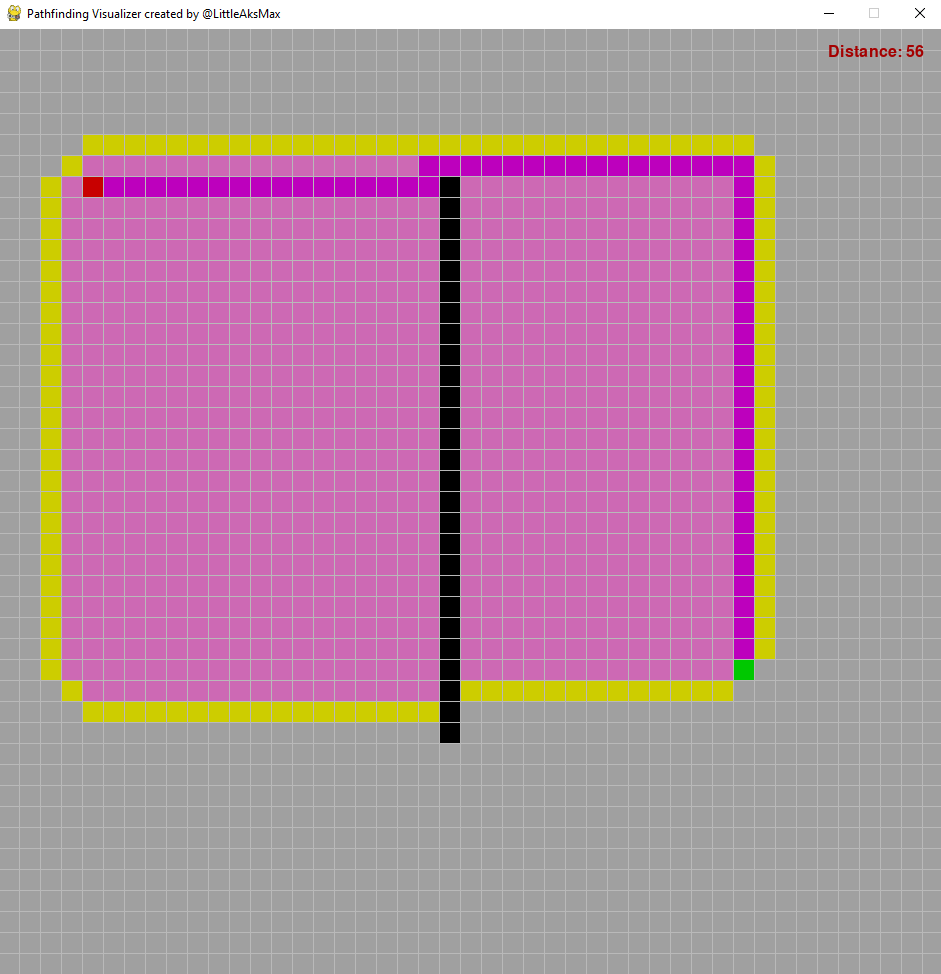

# pathfinding-visualizer
Pathfinding visualizer made in python with PyQt5 and pygame

- algorithms: BFS, DFS, A*, Dijkstra's algorithms
- grid size is a choice from 21, 27, 35, 45, 63, 105, and 135, because I used a screen size of 945 (width and height as it is a square window), 945 has the most *odd* factors between 20 and 150, so I decided to use that
- *Random Maze* creates a maze and also a random start and end point on the left and right borders of the maze respectively
- *Quick Visualize* skips the drawing steps between steps, and only draws the final path from start to end
- *Show Generation* shows the algorithm that generates the maze at work, it is only enabled once the *Random Maze* option is enabled
- keep in mind that DFS and BFS don't necessarily find the longest path, but they will always find a path

- maze generated by using recursive backtracking, you can see it at work if you check the *Show Generation* checkbox on the dialog
- since recursive backtracking, which creates nice mazes if the dimensions for the grid are odd
- there is only one path from start to end
- length of path shown (although not clearly) in the top right of the screen

- red is the start point
- green is the end point
- pink is the closed set
- yellow is the open set
- purple is the path that was retraced from start to end
